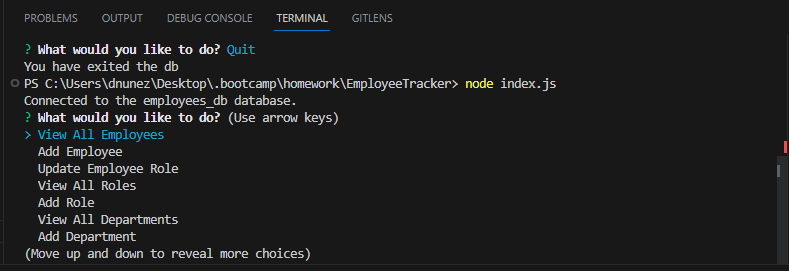
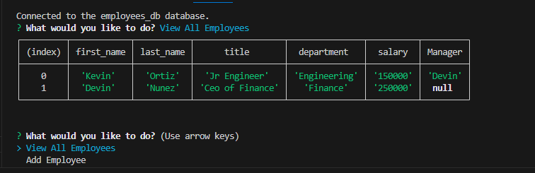

# README.MD Employee Tracker

## Author

Devin Nunez

Email: devv-nunn@gmail.com
git: https://github.com/devv-nunn

## Description

In this project we will create a console application using node.js. This application will allow users to read and write to our employees database.

We Use The Inquirer library multiple times.
Inquirer has two parts. Prompt in which we went over stores the questions and the answers. Next will be the .then will take the responses and and view and/or make various changes to our database using various conditions and sql queries.

We also use Mysql12 to get access to the functions that allow use to perform quieries in our node file.

In this project we learned more about the node inquirer and We learned how to connect a node with a sql database and perform task against the database. 
## Table of Contents (Optional)

N/a

## Installation

- vs.code and node.js must be installed to use this applicationn

- Clone the following repository after installing vs.code and node.js 

- in terminal run npm i as it will download necessary dependencies such as express and mysql12

- for mysql download docker and start a mysql container. Documentation on this process online.

## Usage

To use this application write "node index.js" this will start a series of questions in the command line which will be used to decide which sql query to run
## Application screenshots

## Videos Demonstrating application:

application functionality showcase:
https://drive.google.com/file/d/1hrKjd-XVxv_x2z_B5D5iNi3Oog2eeyRL/view

## Deployment

Repo: https://github.com/DevinDevelopment/EmployeeTracker

# Tech Stack

HTML
CSS
JavaScript
node.js
mysql

## Credits

N/a

## License

MIT License.